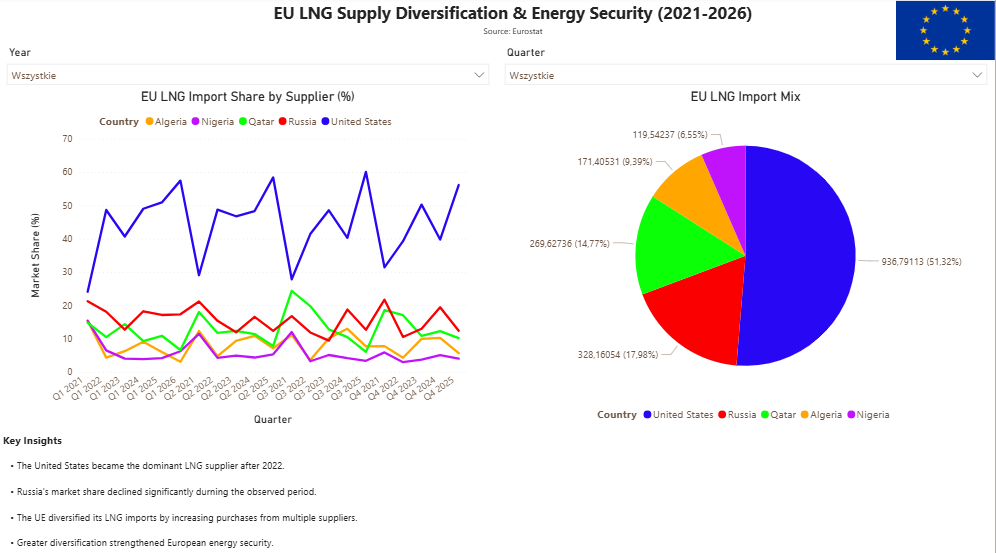

# EU LNG Supply Diversification & Energy Security (2021–2026)

## Project Overview

This project analyzes the diversification of Liquefied Natural Gas (LNG) imports into the European Union between 2021 and 2026.
The focus is on how the EU reduced dependency on individual suppliers and how global geopolitical events (especially after 2022) reshaped energy trade flows.

The dashboard was built in **Power BI Desktop** using publicly available data from energy security and market reports.

---

## Objective

- Analyze EU LNG import structure over time
- Track changes in supplier market shares
- Identify impact of geopolitical events on energy flows
- Visualize diversification trends in EU energy security

---

## Dataset

The dataset includes quarterly LNG import data for the EU from major suppliers:

- United States
- Russia
- Qatar
- Algeria
- Nigeria

Metrics:
- Import volumes
- Market share (%)
- Time range: 2021–2026 (quarterly)

Source: Public energy trade datasets (IEEFA-inspired data)

---

## Tools & Technologies

- Power BI Desktop
- Power Query
- Data cleaning in Excel / CSV
- Data modeling (relationships + transformations)
- DAX (basic measures)

---

##  Dashboard Features

- Interactive line chart showing LNG market share over time
- Donut chart showing supplier structure for selected period
- Year and Quarter slicers for dynamic filtering
- Key insights panel summarizing main trends
- Clean, executive-style layout

---

##  Key Insights

- The United States became the dominant LNG supplier to the EU after 2022
- Russia's share declined significantly following geopolitical disruptions
- Qatar, Algeria, and Nigeria maintained relatively stable but smaller shares
- EU LNG imports became more diversified, improving energy security resilience

---

## Key Takeaway

The project demonstrates how geopolitical events directly influence global energy markets and highlights the increasing importance of supply diversification for European energy security.

---

## Dashboard Preview

